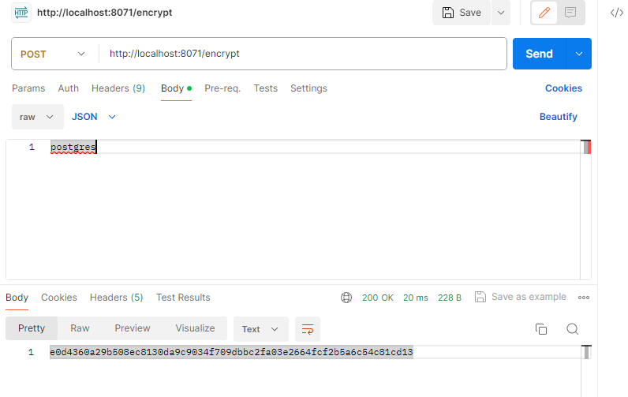
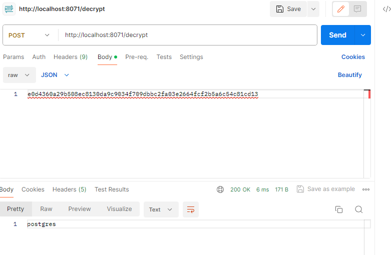

# Config server licensing

### Инструменты:

Java(21), Spring Boot(3.2.1).

### Описание работы:
Данный сервис позволяет получать конфигурационные настройки. На данный момент конфигурационные настройки расположены на открытом репозитории [гит](https://github.com/ZubovVP/config) и внутри самого проекта в папке resources/config.
Для проверки работы сервиса необходимо запустить проект и осуществить переход по следующей ссылке: [ссылка](http://localhost:8071/licensing-service/dev) (по этой ссылке можно получить конфигурационные настройки принадлежащие для отдела разработки и дефолтные настройки, которые расположены на гите).  

А при переходе по ссылке: [ссылка](http://localhost:8071/licensing-service/env) можно получить дефолтные настройки.  
При переходе по ссылке: [ссылка](http://localhost:8071/licensing-service/test) можно получить настройки для тестирования, которые лежат внутри проекта и дефолтные настройки.   

### Шифрование пароля:  
Хранить в системы пароль незашифрованный очень небезопасно, для этого можно применить симметричное шифрования. Для этого необходимо добавить в application.yaml\
encrypt:\
key: secretkey\
Данная запись сообщает Config Server использовать это значение в качестве ключа симметричного шифрования.
Для получения ключа в зашифрованном формате необходимо сделать POST запрос по адресу http://localhost:8071/encrypt и в теле запроса указать строку, которую необходимо зашифровать\
  
В ответ мы получим ключ в зашифрованном виде.  Для дешифрования необходимо сделать POST запрос по следующему адресу http://localhost:8071/decrypt, с указанием в теле запроса зашифрованную строку. В ответ мы получаем расшифрованный ключ.\

